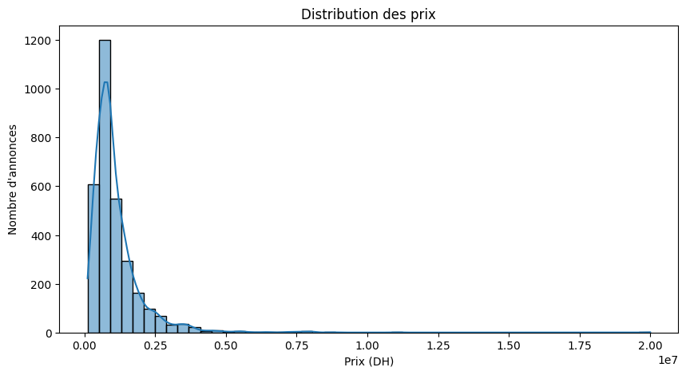
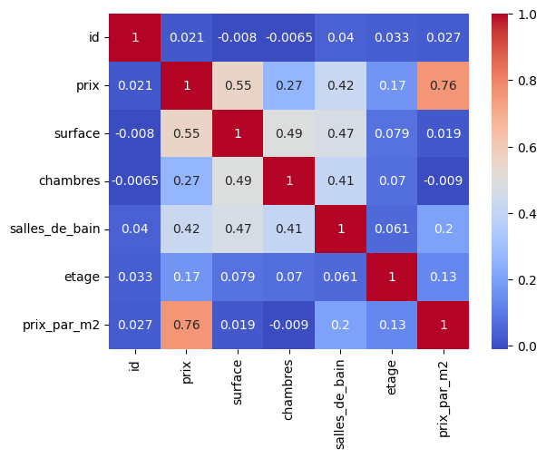
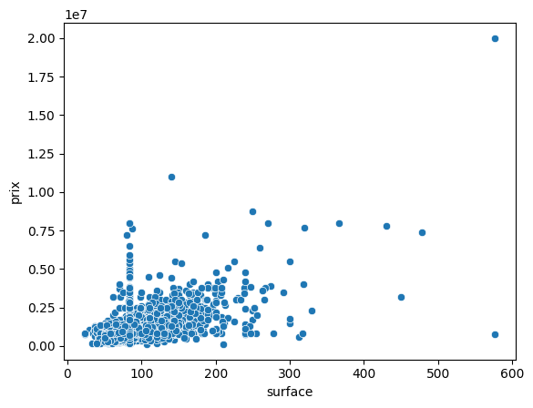
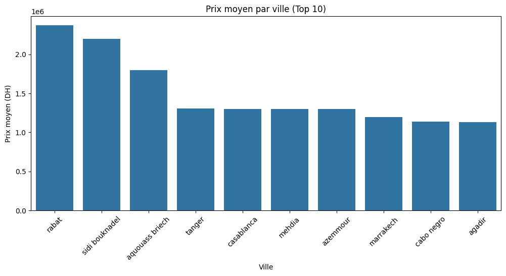
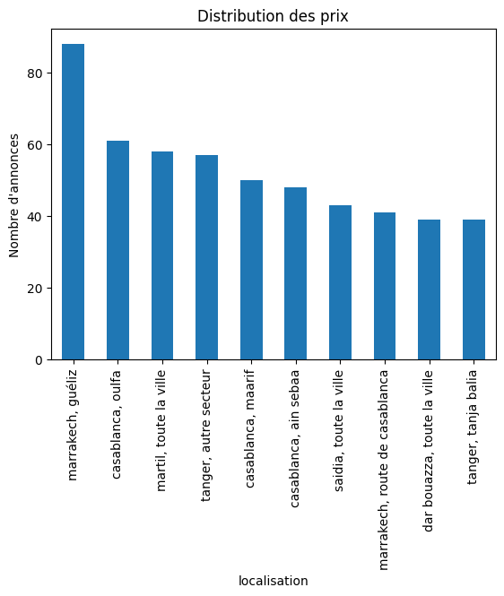
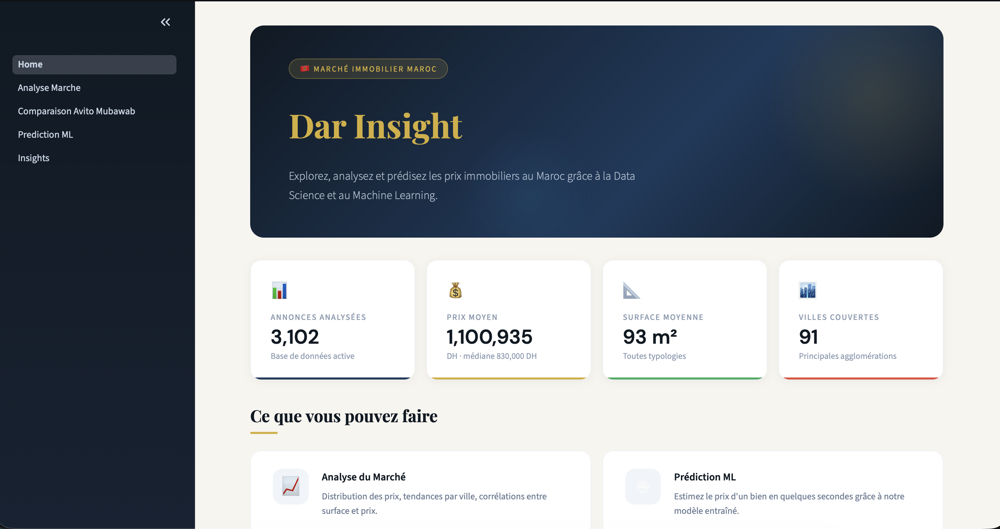
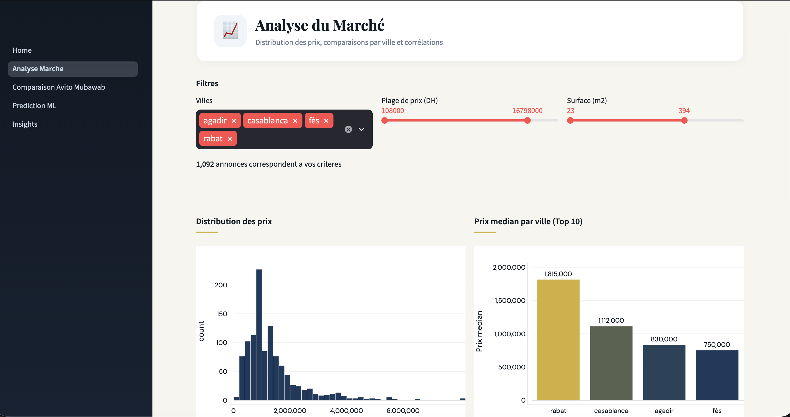
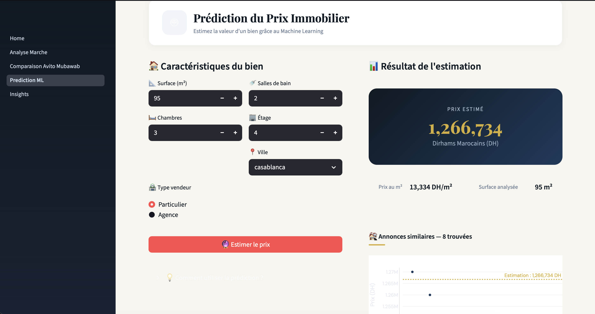

# Dar Insight

**End-to-end Data Science project for analyzing and predicting apartment prices in the Moroccan real estate market.**

Dar Insight combines web scraping, data cleaning, exploratory analysis, feature engineering, machine learning, and an interactive Streamlit dashboard to turn real estate listings into market insights and price estimates.

## Project Overview

### Business Problem

Real estate prices in Morocco vary significantly by city, neighborhood, property size, floor level, and listing characteristics. Buyers, sellers, analysts, and real estate professionals need a structured way to explore market behavior and estimate property prices from listing data.

### Objective

The objective of this project is to build a complete data workflow that:

- Collects apartment listing data from Avito.ma.
- Cleans and standardizes raw marketplace data.
- Explores market trends across cities and property characteristics.
- Engineers useful predictive features.
- Trains a baseline machine learning model for apartment price prediction.
- Presents insights through an interactive Streamlit dashboard.

### Dataset Source

The dataset was collected from public apartment listings on Avito.ma during development. Raw marketplace exports and the full cleaned dataset are intentionally kept local and excluded from GitHub for privacy and legal reasons.

### Expected Value

Dar Insight demonstrates practical skills across the Data Science lifecycle:

- Data acquisition from web sources.
- Data quality management and preprocessing.
- Exploratory Data Analysis.
- Feature engineering for tabular ML.
- Baseline supervised learning.
- Interactive analytics application development.
- Privacy-aware public release preparation.

## Project Visuals

### EDA Graphs

The following figures are generated from the exploratory analysis workflow and stored in the `images/` folder.

#### Price Distribution



This chart shows the distribution of apartment prices in the cleaned dataset.

#### Correlation Heatmap



This heatmap highlights relationships between numerical variables used during analysis and modeling.

#### Surface vs Price



This visualization shows the relationship between apartment surface area and listing price.

#### Average Price by City



This chart compares average apartment prices across the main cities represented in the dataset.

#### Number of Listings by City



This chart shows listing volume by city and helps identify the most represented local markets.

### Streamlit Dashboard Preview

The Streamlit dashboard provides an interactive interface for market exploration, visual analysis, and price prediction.

#### Dashboard Home



#### Market Analysis



#### Price Prediction



## Features

| Feature | Description |
|---|---|
| Web Scraping | Extracts apartment listing data from Avito.ma using Requests and Next.js page data. |
| Data Cleaning | Standardizes numeric fields, handles missing values, removes unusable records, and prepares a clean tabular dataset. |
| Exploratory Data Analysis | Studies price distributions, city-level trends, surface-price relationships, and correlations. |
| Feature Engineering | Creates derived variables such as price per square meter, price categories, surface categories, and floor categories. |
| Machine Learning | Trains a Random Forest regression model to estimate apartment prices from property characteristics. |
| Streamlit Dashboard | Provides an interactive interface for market analysis, insights, platform comparison, and price prediction. |

## Project Architecture

```text
Avito.ma
   ↓
Scraping
   ↓
Cleaning
   ↓
Feature Engineering
   ↓
Exploratory Data Analysis
   ↓
Machine Learning
   ↓
Streamlit Dashboard
```

## Dataset Information

The full cleaned dataset was used during development for EDA, feature engineering, and model training.

For public release, the full dataset is intentionally excluded from GitHub because it may contain marketplace-specific or seller-related information. The repository includes only:

```text
data/sample/sample_data.csv
```

The public sample dataset is anonymized and capped at 500 rows. It removes:

- Listing IDs
- Listing titles
- Seller names
- Original listing dates
- Original listing URLs
- Phone numbers
- Private seller information
- Raw scraped HTML or JSON content

The sample keeps only ML-relevant fields:

| Column | Description |
|---|---|
| `prix` | Apartment price in Moroccan dirhams. |
| `surface` | Apartment surface area. |
| `chambres` | Number of bedrooms. |
| `salles_de_bain` | Number of bathrooms. |
| `etage` | Floor level. |
| `localisation` | General location field. |
| `prix_par_m2` | Price per square meter. |
| `categorie_prix` | Price category. |
| `categorie_surface` | Surface category. |
| `type_etage` | Floor category. |

Important: EDA results and model training were performed on the full local dataset, not on the public sample dataset.

## Exploratory Data Analysis

The EDA workflow explores the structure and behavior of the Moroccan apartment market through:

- Price distribution analysis.
- Surface versus price analysis.
- Correlation analysis across numeric variables.
- Median and average price by city.
- Price per square meter by city.
- Listing volume by location.
- Outlier detection for unrealistic prices or surfaces.

The main EDA notebook is:

```text
notebooks/eda.ipynb
```

## Feature Engineering

The project creates several derived features to improve analysis and modeling:

| Feature | Purpose |
|---|---|
| `prix_par_m2` | Normalizes property price by surface area. |
| `categorie_prix` | Groups listings into price bands for segmentation. |
| `categorie_surface` | Groups listings by apartment size. |
| `type_etage` | Converts floor level into interpretable floor categories. |
| `ville` | Extracted from `localisation` for city-level analysis and encoding. |
| `surface_log` | Log-transformed surface used by the training script. |
| `total_pieces` | Combined bedroom and bathroom count used by the training script. |
| `ratio_chambres_surface` | Bedroom density relative to surface area. |
| `est_agence` | Binary seller-type feature used locally during model training. |
| `ville_encoded` | City encoding based on median price. |
| `prix_median_ville` | Median city price feature used by the model. |

## Machine Learning

The modeling workflow predicts apartment prices from structured property features.

| Item | Value |
|---|---|
| Problem type | Supervised regression |
| Target variable | `prix` |
| Train/Test split | 80/20 |
| Model | Random Forest Regressor |
| Current training script | `src/models/train.py` |
| Evaluation script | `src/models/evaluate.py` |

The current training script uses:

```python
RandomForestRegressor(n_estimators=300, max_depth=15, random_state=42)
```

The model objective is to estimate apartment prices from property characteristics such as surface, rooms, bathrooms, floor level, city-level encoding, and engineered ratios.

### Recorded Metrics

One notebook-recorded Random Forest run includes:

| Metric | Value |
|---|---:|
| MAE | 299,802.74 DH |
| R² | 0.3186 |

These metrics are kept as a historical notebook reference. The public repository does not include the full private dataset or trained pickle artifacts, so final metrics should be recomputed locally with:

```bash
python3 src/models/evaluate.py
```

## Dashboard

The Streamlit dashboard is the main user-facing application. It loads the full local cleaned dataset when available and falls back to the anonymized public sample dataset in a fresh public clone.

Dashboard areas include:

| Page | Purpose |
|---|---|
| Home | Project summary, KPIs, and quick market overview. |
| Market Analysis | Price distribution, city comparisons, surface-price relationship, and descriptive statistics. |
| Platform Comparison | Roadmap-style comparison between Avito and Mubawab integration. |
| Price Prediction | Interactive form for estimating apartment prices using the local trained model when available. |
| Insights | City-level market highlights, listing volume, price per square meter, and global summary statistics. |

No dashboard screenshots are currently included in the repository.

## Repository Structure

```text
dar-insight/
├── airflow/
│   └── dags/
│       └── scraping_dag.py
├── data/
│   ├── sample/
│   │   └── sample_data.csv
│   ├── raw/                 # local-only, ignored by Git
│   └── processed/           # local-only, ignored by Git
├── models/
│   ├── model.ipynb
│   ├── model1.ipynb
│   ├── model2.ipynb
│   └── model_v2.ipynb
├── notebooks/
│   └── eda.ipynb
├── src/
│   ├── cleaning/
│   │   └── clean_avito.ipynb
│   ├── dashboard/
│   │   ├── Home.py
│   │   ├── pages/
│   │   │   ├── 1_Analyse_Marche.py
│   │   │   ├── 2_Comparaison_Avito_Mubawab.py
│   │   │   ├── 3_Prediction_ML.py
│   │   │   └── 4_Insights.py
│   │   └── utils/
│   │       ├── data.py
│   │       └── styles.py
│   ├── data/
│   │   ├── ingestion.py
│   │   └── preprocessing.py
│   ├── features/
│   │   └── engineering.py
│   ├── models/
│   │   ├── evaluate.py
│   │   └── train.py
│   └── scraping/
│       ├── avito_scraper.py
│       ├── debug_avito.py
│       ├── mubawab_scraper.py
│       └── utils.py
├── .gitignore
├── README.md
└── requirements.txt
```

Local files such as raw scraped data, processed private datasets, model pickle files, archives, caches, and virtual environments are excluded through `.gitignore`.

## Installation

Clone the repository:

```bash
git clone https://github.com/your-username/dar-insight.git
cd dar-insight
```

Create and activate a virtual environment:

```bash
python3 -m venv venv
source venv/bin/activate
```

On Windows:

```bash
python -m venv venv
venv\Scripts\activate
```

Install dependencies:

```bash
pip install -r requirements.txt
```

## Usage

The real Streamlit application entry point is:

```bash
streamlit run src/dashboard/Home.py
```

Optional local-only workflow:

```bash
python3 src/scraping/avito_scraper.py
python3 src/models/train.py
python3 src/models/evaluate.py
```

The optional workflow regenerates local private data and model artifacts that are intentionally ignored by Git.

## Tech Stack

| Area | Technologies |
|---|---|
| Programming | Python |
| Data Processing | Pandas, NumPy |
| Web Scraping | Requests, BeautifulSoup, Selenium |
| Machine Learning | Scikit-learn, Joblib |
| Visualization | Plotly, Matplotlib, Seaborn |
| Dashboard | Streamlit |
| Experimentation / Pipeline Tools | MLflow, DVC, Apache Airflow |
| Testing | Pytest |

## Privacy & Legal Notice

This repository is intended for educational and portfolio purposes.

Raw scraped data is not published. Sensitive marketplace data is excluded from GitHub, including seller names, phone numbers, listing IDs, listing URLs, raw HTML dumps, raw JSON dumps, and full marketplace exports.

If you reproduce or extend the scraping workflow, review the source website terms of service and applicable privacy requirements before collecting, storing, or sharing data.

## Future Improvements

Potential next steps include:

- Compare additional models such as XGBoost, LightGBM, CatBoost, and regularized linear baselines.
- Add richer features such as exact neighborhood, property condition, amenities, building age, parking, elevator availability, and proximity to transport.
- Containerize the project with Docker.
- Build a scheduled ingestion pipeline with Airflow.
- Add data validation checks for scraped data quality.
- Track experiments and model versions with MLflow.
- Add a reproducible training pipeline with DVC.
- Deploy the dashboard and prediction service.
- Add automated tests and CI workflows.

## Author

**Iliass Gzouli**

Data Science & IoT Engineering Student

- LinkedIn:https://www.linkedin.com/in/iliass-gzouli-b0615a324/
- GitHub:https://github.com/IliassGzouli
- Email: iliassgzouli@gmail.com
